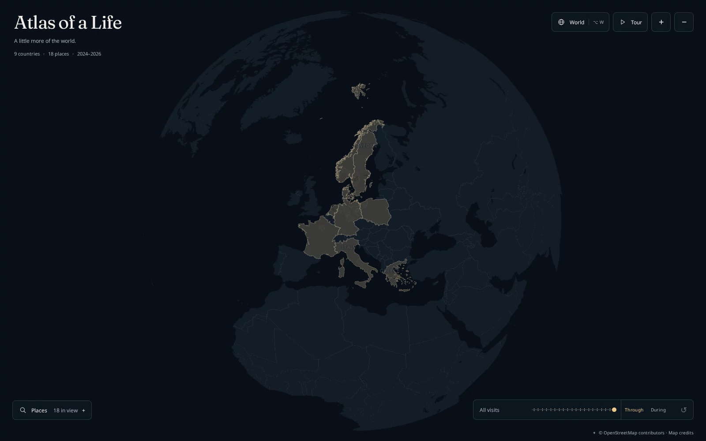
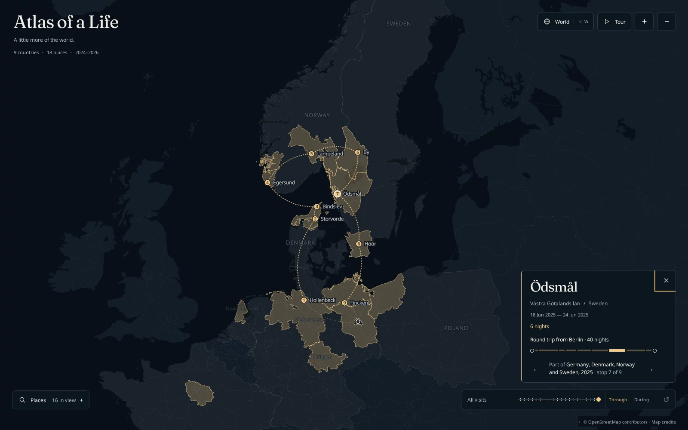
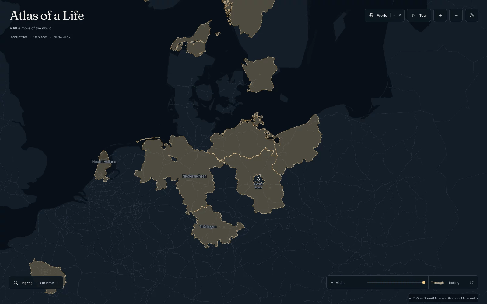
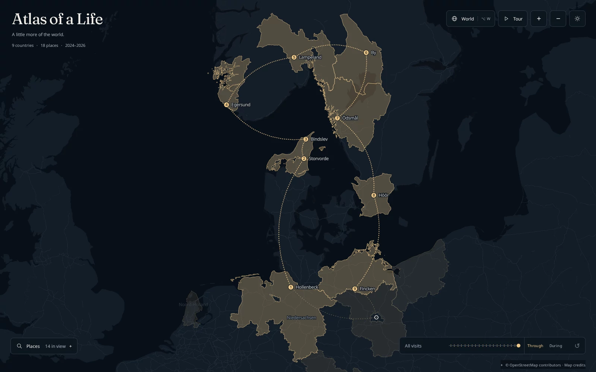
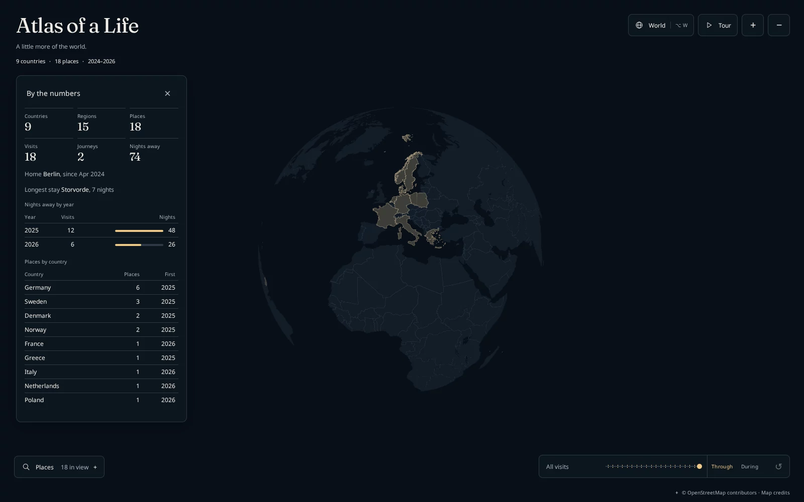
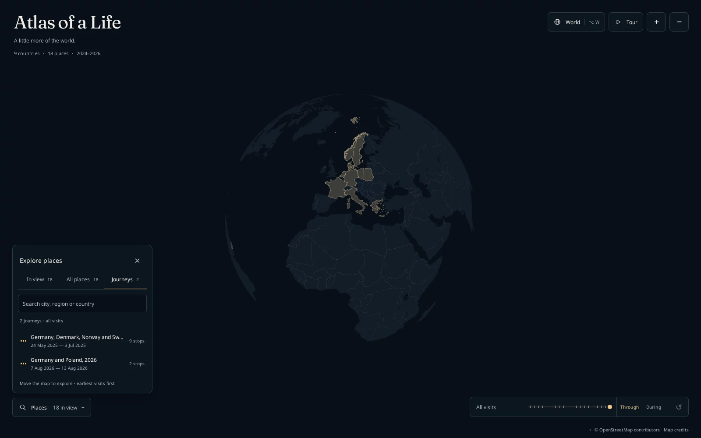
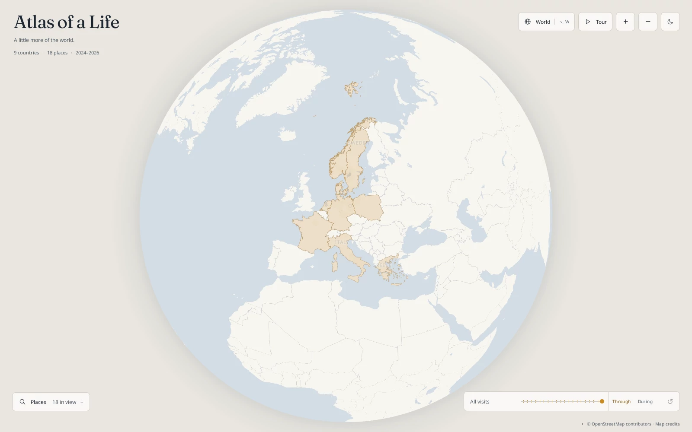
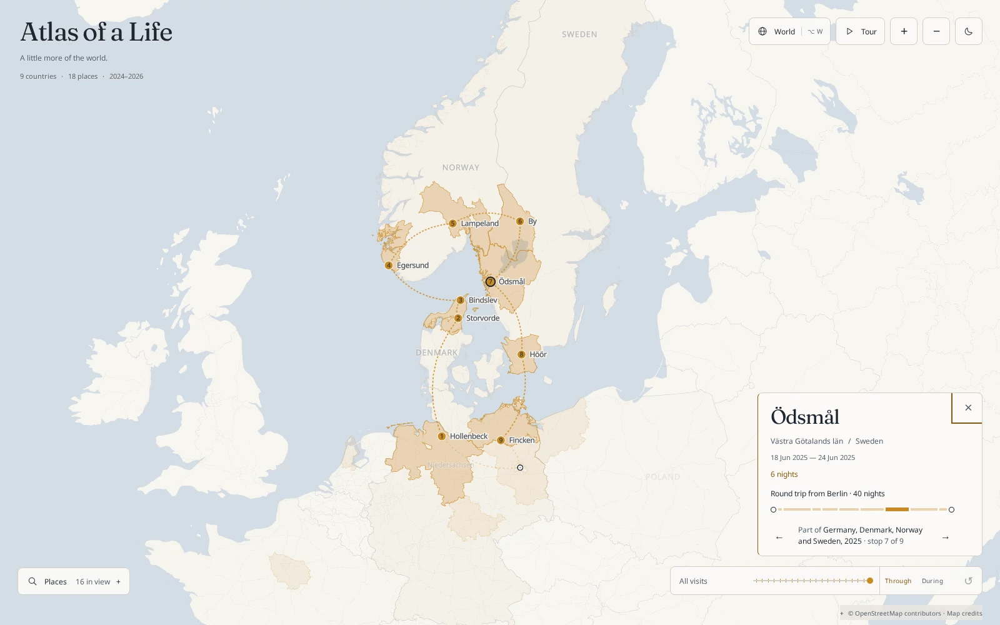
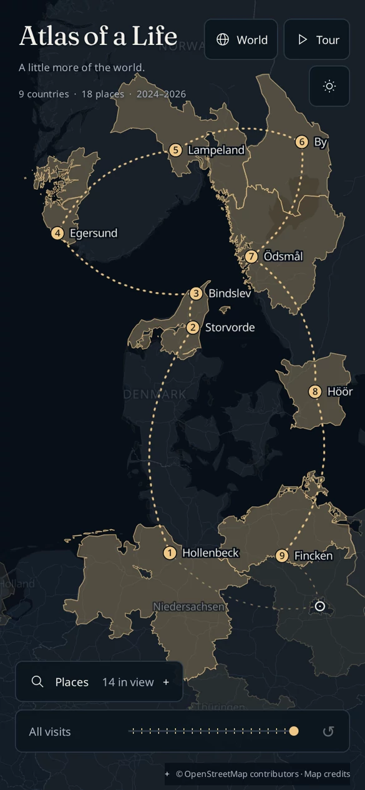
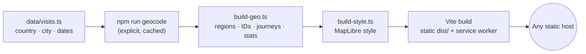

<div align="center">
  <picture>
    <source media="(prefers-color-scheme: dark)" srcset="docs/assets/atlas-wordmark-dark.svg" />
    <source media="(prefers-color-scheme: light)" srcset="docs/assets/atlas-wordmark-light.svg" />
    
  </picture>
  <div>
    <a href="https://github.com/jbspeakr/atlas-of-life/actions/workflows/deploy.yml">
      
    </a>
    <a href="https://atlas.brnnnsthl.eu/">
      
    </a>
    <a href="LICENSE">
      
    </a>
    
    
    <a href="https://deepwiki.com/jbspeakr/atlas-of-life">
      
    </a>
  </div>
  <p>
    A quiet, night-sky atlas of the places you've been.<br />
    <strong>Write down a country, a city and a date. Get a living globe.</strong>
  </p>
</div>

<p align="center">
  <!-- Tour recording: replace this image with the recorded tour (see AGENTS.md, "Documentation conventions"). -->
  
</p>

---

**Atlas of a Life** turns a plain list of trips into a calm, beautiful map you can publish anywhere. Globe → countries → regions → places is one continuous MapLibre zoom, not three screens. Every country you have been to lights up in lamplight gold; every region you slept in is drawn at its real shape; every consecutive run of stays becomes a journey you can step through.

You author almost nothing. No coordinates, no region codes, no IDs:

```ts
{ country: "GR", city: "Kalamos", dateRange: ["2025-04-27", "2025-05-02"] }
```

The build finds the city, discovers which region it belongs to, generates stable links, infers journeys from your dates, computes your statistics and ships a static site with a strict Content Security Policy. Your private data stays in the repository; only city-precision public facts reach the browser.

## Key features

- **One continuous zoom**<br>
  A north-up globe that flows from the whole world to countries, regions and individual places, with names that hand over from band to band.

- **Journeys, inferred**<br>
  Adjacent dates become journeys automatically. Focus one and dotted arcs and numbered stops reveal in travel order, leaving from and returning to your home base. The arcs are curved on purpose: they say "from here to there", never "the road taken".

- **Night and day**<br>
  Opens in your system's appearance. Night is lamplight on a midnight globe under a sparse, still starfield; day is the same atlas printed on paper in ink and ochre. One button switches, and the choice sticks.

- **A caption, not a card**<br>
  Select a place for its region, dates and nights stayed, plus an itinerary strip whose segments are as wide as each stay. Step to the previous or next stop with **←**/**→**.

- **Time you can scrub**<br>
  A timeline with one tick per visit. **Through** shows everywhere you had been by a date; **During** lights only what was under way that month.

- **Every view is a link**<br>
  The address bar follows the map: a place, a camera position, a timeline position. Share exactly what you see.

- **By the numbers**<br>
  Countries, regions, places, journeys, nights away, the longest stay, nights by year and places by country, all computed at build time.

- **A tour, in the app and on film**<br>
  **Tour** flies from wherever you are into a 24-second cinematic sequence. `npm run record` renders the same shots to H.264 MP4 in portrait, square and landscape, ready for social media.

- **Privacy first**<br>
  City precision by default. Addresses, precision flags and cache provenance never enter the build output, enforced by a publication allowlist that verification audits on every run.

- **Made for phones**<br>
  The places directory becomes a bottom sheet that rides above the keyboard, and a tap picks the nearest place within a thumb's reach.

- **Installable and offline**<br>
  A web app manifest and a build-generated service worker. With a bundled basemap you can save the whole map for offline use.

- **Fast, accessible, verified**<br>
  Keyboard-first controls, reduced-motion support, axe checks, frame-time budgets, payload budgets and pixel-exact visual baselines. A change is merged when the numbers say so, not when it looks fine.

## Gallery

<table>
  <tr>
    <td width="50%"></td>
    <td width="50%"></td>
  </tr>
  <tr>
    <td><sub><b>The globe.</b> Visited countries light up in the order you first went there.</sub></td>
    <td><sub><b>Journeys.</b> Nine stops from Berlin through Denmark, Norway and Sweden and home again, with the caption and its itinerary strip.</sub></td>
  </tr>
  <tr>
    <td></td>
    <td></td>
  </tr>
  <tr>
    <td><sub><b>Regions.</b> Real subdivision shapes, discovered from each city's location. Home is the hollow ring.</sub></td>
    <td><sub><b>Round trips.</b> Choose a journey and the camera frames it end to end.</sub></td>
  </tr>
  <tr>
    <td></td>
    <td></td>
  </tr>
  <tr>
    <td><sub><b>By the numbers.</b> Everything derived from your dates and geography, nothing else.</sub></td>
    <td><sub><b>Places.</b> Browse what is in view, everything, or journeys. Search ignores accents.</sub></td>
  </tr>
  <tr>
    <td></td>
    <td></td>
  </tr>
  <tr>
    <td><sub><b>Day.</b> The same atlas printed on paper, for bright rooms and light-mode people.</sub></td>
    <td><sub><b>Day journeys.</b> Ink and ochre, with the same contrast as night.</sub></td>
  </tr>
</table>

<p align="center">
  
  <br />
  <sub>On a phone, one surface at a time.</sub>
</p>

## Quick start

Requires Node **22.12+** and npm.

```sh
git clone https://github.com/jbspeakr/atlas-of-life.git
cd atlas-of-life
npm ci
npm run dev
```

The first run installs a small committed preview basemap, so the atlas works immediately without any account or API key. When you're ready to publish:

```sh
npm run build     # static site in dist/
npm run preview   # serve dist/ locally
```

Deploy `dist/` to any static host. The included GitHub Actions workflow verifies every push and publishes `main` to GitHub Pages.

## Make it yours

1. **Set your home and add your visits** in [`data/visits.ts`](data/visits.ts), or let the command do it:

   ```sh
   NOMINATIM_CONTACT=you@example.org npm run add -- GR Kalamos 2025-04-27..2025-05-02
   npm run import -- trips.csv
   ```

2. **Pick a basemap.** Keep the preview, bundle a complete archive with `npm run basemap:build`, or host one remotely (a Hugging Face dataset pinned to a commit works well).
3. **Build and deploy.** Commit your visits and geocache, push to `main`, done.

The [data authoring guide](docs/DATA.md) covers identities, precision and ambiguous place names. The [guide](docs/GUIDE.md) covers everything else.

## How it works



Geocoding happens only when you ask for it, never during a build. Boundaries come from Natural Earth and geoBoundaries at pinned checksums, simplified into two levels of detail: the coarse one ships with the page, the fine one loads when you zoom in. The browser receives an explicit allowlist of public fields and nothing else.

Built with [MapLibre GL JS](https://maplibre.org/), [PMTiles](https://docs.protomaps.com/pmtiles/) and [Protomaps](https://protomaps.com/) basemaps, React 19, TypeScript, Zod, Vite, Vitest and Playwright.

## Documentation

| Document | What's in it |
| --- | --- |
| [Guide](docs/GUIDE.md) | Running, exploring, recording, basemaps, verification, hosting and security. |
| [Data authoring](docs/DATA.md) | Writing `data/visits.ts`: home, journeys, regions, precision, IDs. |
| [Decisions](docs/DECISIONS.md) | Why the atlas looks and behaves the way it does. |
| [Evolution](docs/EVOLUTION.md) | Measured experiments and their results. |
| [Roadmap](docs/ROADMAP.md) | The September 2026 release plan in detail. |
| [Attribution](docs/ATTRIBUTION.md) | Data and font licences. |
| [AGENTS.md](AGENTS.md) | A map of the codebase for coding agents and new contributors. |

## Roadmap

The ten releases of the [September 2026 plan](docs/ROADMAP.md) have shipped:

- [x] A real CI gate: quick verification on every push and pull request
- [x] Diacritic-insensitive search, on-screen zoom, locale-aware names, favicon and social card
- [x] Country and region names in the middle zoom band, with hover affordance
- [x] Progressive geometry: coarse boundaries inline, fine ones on demand
- [x] An ordinal timeline with **Through** and **During**, shareable URLs and short IDs
- [x] Journeys with curved arcs, numbered stops, a home base and caption stepping
- [x] The in-app tour
- [x] **By the numbers**
- [x] `npm run add` and `npm run import`
- [x] Installable app shell and opt-in offline map

Since then:

- [x] Day and night themes, a sparse starfield and a globe halo
- [x] A mobile bottom sheet, thumb-sized tap targets and a tour that starts from the current view

Up next:

- [ ] **Green full GPU verification** on the self-hosted runner, with approved visual baselines for everything above
- [ ] **A complete published basemap**: global z0–6 plus city detail, hosted on a pinned Hugging Face dataset
- [ ] **Lighter geometry**: bring all boundary levels of detail back under the 400 KB gzip target (about 615 KB today)

Have an idea or found a bug? [Open an issue](https://github.com/jbspeakr/atlas-of-life/issues).

## Contributing

Contributions are welcome. Start with [AGENTS.md](AGENTS.md) for the lay of the land and the rules that are not negotiable (privacy allowlist, one accent colour, approved baselines). Before opening a pull request, run:

```sh
npm test
npm run lint
npm run verify -- --quick
```

Same-repository pull requests get the verification objective table as a comment.

## Contributors

<a href="https://github.com/jbspeakr/atlas-of-life/graphs/contributors">
  
</a>

### Star history

<a href="https://www.star-history.com/#jbspeakr/atlas-of-life&Date">
  <picture>
    <source media="(prefers-color-scheme: dark)" srcset="https://api.star-history.com/svg?repos=jbspeakr/atlas-of-life&type=Date&theme=dark" />
    <source media="(prefers-color-scheme: light)" srcset="https://api.star-history.com/svg?repos=jbspeakr/atlas-of-life&type=Date" />
    
  </picture>
</a>

## Licence

Code is [MIT](LICENSE). Geographic data keeps its upstream licences: Natural Earth is public domain, geoBoundaries gbOpen is CC BY 4.0, OpenStreetMap data is ODbL. Fonts are under the SIL Open Font License. See [attribution](docs/ATTRIBUTION.md).

---

<div align="center">
  <picture>
    <source media="(prefers-color-scheme: dark)" srcset="docs/assets/atlas-wordmark-dark.svg" />
    <source media="(prefers-color-scheme: light)" srcset="docs/assets/atlas-wordmark-light.svg" />
    
  </picture>
  <p><sub>A little more of the world.</sub></p>
</div>
